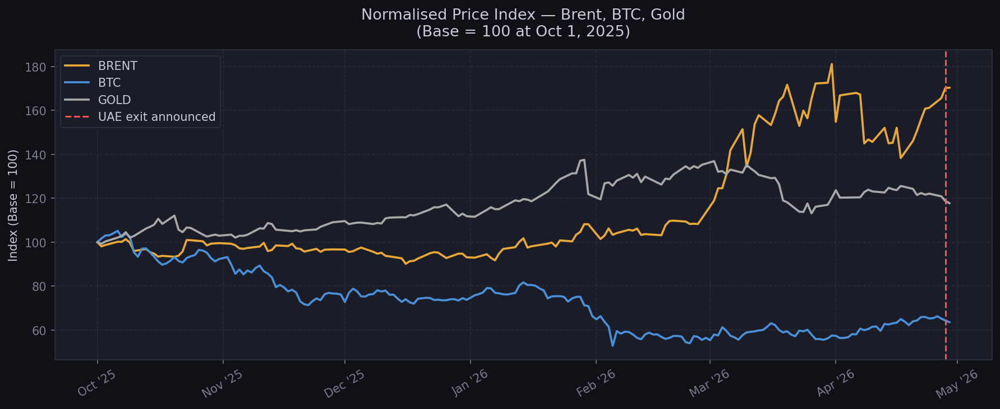
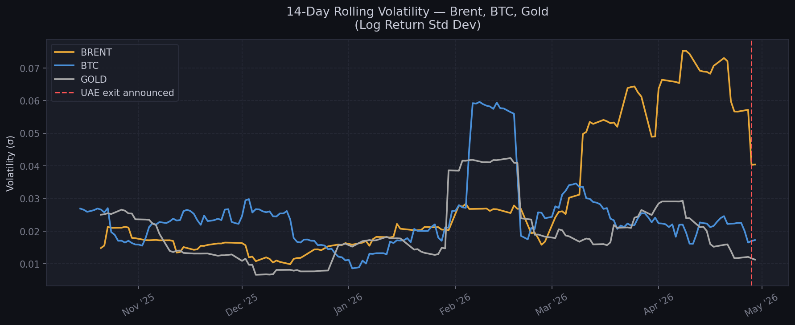
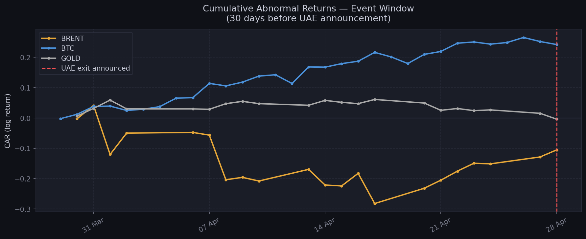
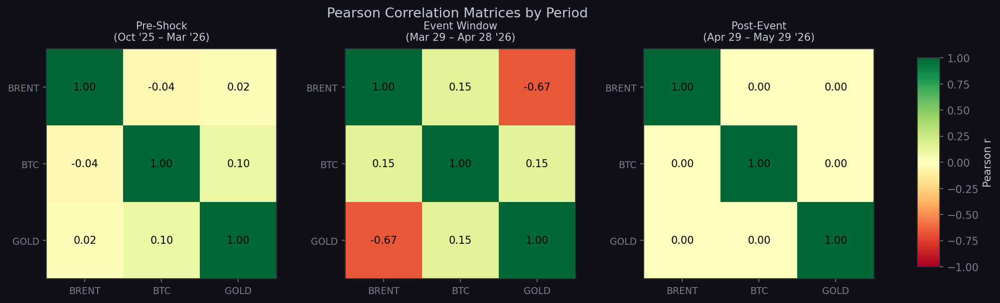

# Cross-Asset Geopolitical Shock Analysis: UAE–OPEC Exit (2026)

**Author:** Saki Cansev  
**GitHub:** [github.com/sakicansev](https://github.com/sakicansev)  
**Tools:** Python · pandas · matplotlib · scipy · SQLite · yfinance  
**Data:** Real market data via yfinance  
**Status:** Complete

---

## Overview

On April 28, 2026, the United Arab Emirates announced its withdrawal from OPEC and OPEC+,
effective May 1 — ending nearly 60 years of membership. The decision came amid an active
US-Israel military campaign against Iran, a near-closure of the Strait of Hormuz, and Brent
crude trading above $110/barrel.

This project applies a **cross-asset event study framework** to measure how three
fundamentally different asset classes responded to this geopolitical shock:

| Asset | Ticker | Type |
|-------|--------|------|
| Brent Crude Oil | BZ=F | Commodity — directly affected |
| Bitcoin | BTC-USD | Decentralised digital asset |
| Gold | GC=F | Traditional safe-haven |

---

## Research Questions

1. Which asset reacted most strongly to the UAE–OPEC shock?
2. Did correlations between assets break down during the event window?
3. Were abnormal returns present — and in which direction?
4. Does Bitcoin behave as a safe-haven or a risk asset during geopolitical crises?

---

## Key Event Timeline

| Date | Event | Category |
|------|-------|----------|
| 2025-10-01 | US-Israel military operations against Iran begin | Conflict |
| 2026-02-01 | Strait of Hormuz near-closure — Brent peaks ~$119/bbl | Market |
| 2026-04-27 | UAE diplomat publicly criticises GCC response to Iran | OPEC |
| 2026-04-28 | UAE announces OPEC + OPEC+ exit, effective May 1 | OPEC |
| 2026-05-01 | UAE formally leaves OPEC and OPEC+ | OPEC |

---

## Methodology

### Event Study Windows
| Window | Period | Purpose |
|--------|--------|---------|
| Estimation | 2025-10-01 to 2026-03-28 | Compute baseline expected returns |
| Event window | 2026-03-29 to 2026-04-28 | Measure abnormal activity pre-announcement |
| Post-event | 2026-04-29 to 2026-05-29 | Track market reaction after formal exit |

### Metrics Computed
- **Daily log returns** — `ln(P_t / P_{t-1})`, time-additive and suitable for cumulation
- **14-day rolling volatility** — rolling standard deviation of log returns
- **Abnormal return** — actual return minus mean return from estimation window
- **Cumulative Abnormal Return (CAR)** — sum of abnormal returns over event window
- **Pearson correlation matrix** — computed separately for each period

---

## Results

### Chart 1 — Normalised Price Index



**What it shows:** All three assets rebased to 100 at October 1, 2025.

**What happened:**
- **Gold** rose steadily and consistently from the start — reaching +35% above baseline
  by February 2026. This is the textbook safe-haven response: as geopolitical risk
  accumulated through late 2025, institutional money rotated into gold early and steadily.
- **Brent** remained flat through Q4 2025, then surged sharply from January 2026 onward,
  peaking at +80% above baseline in April. The Hormuz near-closure in February was the
  inflection point — suddenly supply disruption was no longer theoretical.
- **Bitcoin** tells a completely different story. It fell steadily from October 2025,
  dropping to nearly -40% below baseline by February 2026 — exactly when the conflict
  escalated most. This is not safe-haven behaviour. BTC moved like a risk asset: when
  fear spiked, investors sold it.

**Key insight:** Gold and Brent diverged fundamentally from Bitcoin. Gold anticipated the
risk early. Brent responded to the supply shock. Bitcoin was caught in the risk-off selloff.

---

### Chart 2 — 14-Day Rolling Volatility



**What it shows:** How turbulent each asset's daily price movements were over any 14-day
rolling window.

**What happened:**
- **Bitcoin** spiked to 0.06 volatility in February 2026 — the highest point across all
  three assets at that moment. This coincided with the Hormuz near-closure. BTC is
  structurally the most volatile of the three and reacted fastest in pure noise terms.
- **Brent** had low volatility through Q4 2025, then began climbing steadily from
  February onward. By April 2026 — the weeks leading into the UAE announcement — Brent
  reached its highest volatility of the entire period at 0.075. This is significant: it
  means oil traders were increasingly uncertain and active in the weeks before the
  announcement, suggesting the market was pricing in instability before it was confirmed.
- **Gold** remained the calmest asset throughout, never exceeding 0.043. This is exactly
  what gold is supposed to do — absorb demand without becoming chaotic.

**Key insight:** Brent's volatility peak came just before the UAE announcement, not after.
This suggests the oil market was already anticipating structural instability in OPEC weeks
before April 28.

---

### Chart 3 — Cumulative Abnormal Returns (Event Window)



**What it shows:** For each asset, the accumulated gap between what actually happened
and what would have been expected based on the prior 6-month baseline — measured over
the 30 days leading up to the UAE announcement.

**What happened:**
- **Bitcoin (CAR: +0.24)** showed the strongest positive abnormal return. BTC performed
  significantly above its own depressed baseline during the event window. This sounds
  contradictory given Chart 1, but it makes sense: BTC's baseline was already low, so
  any stabilisation registered as outperformance versus expectation. The market had
  already priced in the worst for BTC — the event window brought partial relief.
- **Gold (CAR: ~0.00)** was essentially flat against its own baseline. This means gold
  continued doing exactly what it had been doing — its safe-haven bid was already fully
  priced in from months earlier. No surprise, no abnormal move.
- **Brent (CAR: -0.10)** underperformed its own baseline significantly, with the worst
  point reaching -0.30 in mid-April. This is the most important finding: in the 30 days
  before the UAE exit was announced, Brent was already underperforming expectations.
  The market was pricing in OPEC fragmentation risk before the official announcement.

**Key insight:** The UAE exit was not a surprise to oil markets. Brent's negative CAR
shows the market had been discounting OPEC's credibility for weeks. The formal
announcement on April 28 did not create the shock — it confirmed what prices already knew.

---

### Chart 4 — Pearson Correlation Matrices



**What it shows:** How closely the daily returns of each pair of assets moved together,
across three distinct periods.

**What happened:**

**Pre-Shock (Oct '25 – Mar '26):**
All correlations were near zero. Brent/BTC: -0.04. Brent/Gold: +0.02. BTC/Gold: +0.10.
These three assets were moving independently of each other — each driven by its own
supply, demand and sentiment dynamics.

**Event Window (Mar 29 – Apr 28 '26):**
The most dramatic shift: Brent/Gold correlation collapsed to **-0.67**. This is a strong
negative correlation — when Brent was rising, Gold was falling, and vice versa. This
reflects two opposing forces: Brent was responding to supply shock and OPEC uncertainty
(sellers fearing oversupply from UAE going rogue), while Gold was responding to safe-haven
demand (buyers seeking protection from the same uncertainty). Same geopolitical event —
completely opposite price reactions. BTC correlations remained low, confirming it was
moving on its own dynamics.

**Post-Event (Apr 29 – May 29 '26):**
All correlations returned to near zero. The shock passed, the relationships decoupled
again, and each asset resumed trading on its own fundamentals.

**Key insight:** The -0.67 Brent/Gold correlation during the event window is the
statistical signature of a genuine geopolitical shock. It shows the market splitting
into two camps: those selling oil on supply fears, and those buying gold on safety fears.
This kind of correlation breakdown is exactly what risk managers and portfolio analysts
look for when stress-testing multi-asset portfolios.

---

## Key Conclusions

### 1. Bitcoin is not digital gold — at least not in a geopolitical crisis
BTC fell nearly 40% relative to baseline while Gold rose 35%. In a war environment with
a supply shock, Bitcoin behaved like a tech stock, not a store of value. Investors who
treated BTC as a hedge against geopolitical risk in this period were wrong.

### 2. Oil markets front-ran the OPEC announcement
Brent's negative CAR in the event window — reaching -0.30 before the announcement —
shows that oil futures traders were already pricing in OPEC fragmentation weeks before
April 28. The announcement itself caused a brief spike, but the underlying trend was
already established. This is consistent with how sophisticated commodity markets work:
they discount known risks before they materialise.

### 3. Gold is a slow, steady, early mover
Gold started rising in October 2025 — months before the Hormuz crisis peaked. It did
not spike or crash. It just climbed. This is the behaviour of an asset with deep,
patient institutional demand. When geopolitical risk accumulates, gold absorbs it
without drama.

### 4. Correlation breakdown is the real story
In normal times, these three assets are uncorrelated. Under stress, Brent and Gold
became strongly negatively correlated (-0.67). This has direct implications for
portfolio construction: a portfolio holding both oil and gold futures during this
period would have had its positions working against each other. Understanding when
and why correlations shift is one of the most valuable skills in quantitative finance.

---

## What This Means for the Future

The UAE exit from OPEC is not an isolated event. It is the visible symptom of a
deeper structural shift in global energy geopolitics:

- **OPEC's pricing power is weakening.** If other high-capacity members follow the UAE
  (Kazakhstan, Iraq), the cartel loses its ability to manage supply. This means oil
  prices will become more volatile and more sensitive to individual country decisions.

- **The Hormuz risk is structural, not temporary.** The UAE's Fujairah pipeline — which
  bypasses Hormuz entirely — gives it a strategic export advantage no other OPEC member
  has. This infrastructure investment is now paying off. Expect other Gulf states to
  accelerate similar bypass infrastructure.

- **Bitcoin's role in crisis portfolios needs re-evaluation.** The data from this period
  challenges the narrative of BTC as "digital gold." In practice, during the most acute
  phase of this conflict, BTC moved with risk assets, not safe havens. This may change
  as institutional adoption matures, but right now the evidence points the other way.

- **For data analysts in fintech and crypto:** Events like this create the richest
  datasets. Cross-asset correlation shifts, abnormal return windows, volatility regime
  changes — these are the signals that quantitative analysts are paid to detect and
  interpret. Building the ability to run this kind of analysis on live data, in real
  time, is where the career opportunity lies.

---

## Project Structure

```
opec_geopolitical_analysis/
│
├── data/                    # Raw CSV exports (gitignored)
├── scripts/
│   ├── 01_fetch_data.py     # Download price data via yfinance
│   ├── 02_store_to_db.py    # Load CSVs into SQLite database
│   ├── 03_analysis.py       # Returns, volatility, correlations, event study
│   └── 04_visualise.py      # Generate charts
├── sql/
│   └── schema.sql           # SQLite table definitions (6 tables)
├── outputs/
│   └── charts/              # PNG chart exports
├── requirements.txt
└── README.md
```

---

## Setup & Usage

```bash
git clone https://github.com/sakicansev/opec_geopolitical_analysis
cd opec_geopolitical_analysis
pip install -r requirements.txt
```

Run in order:
```bash
python3 scripts/01_fetch_data.py
python3 scripts/02_store_to_db.py
python3 scripts/03_analysis.py
python3 scripts/04_visualise.py
```

---

## Limitations

- Post-event window data is limited as the event occurred on April 28, 2026 — only
  a short post-event period is currently available. This analysis will be updated
  as more data accumulates.
- The event study assumes a stable estimation window, but the estimation period itself
  (Oct 2025 – Mar 2026) overlapped with the early stages of the Iran conflict. A cleaner
  pre-conflict baseline would strengthen the abnormal return calculations.
- Correlation analysis uses daily returns. Intraday data would reveal faster reaction
  times and sharper breakdowns.

---

## Related Projects

- [btc_eth_conflict_analysis](https://github.com/sakicansev/btc_eth_conflict_analysis) —
  Bitcoin and Ethereum price responses to conflict events using Python, SQL and SQLite

---

*Built with real market data. Analysis conducted on April 30, 2026 — two days after
the UAE announcement.*
